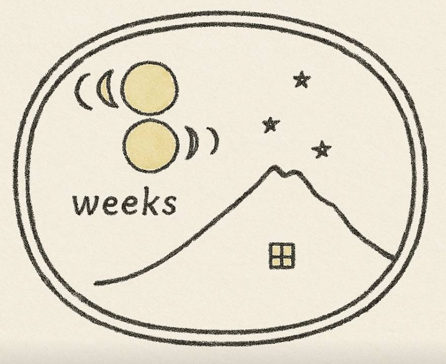

# 8WEEKS FUJIMI ウェブサイト使用方法説明書

## 📋 概要

この説明書は、8WEEKS FUJIMI のランディングページと予約システムの使用方法を説明します。

**作成ファイル**:
- `index.html` - メインランディングページ
- `booking.html` - 予約フォームページ  
- `booking.js` - 予約システムJavaScript
- `Google_APIs_Setup_Guide.md` - Google APIs設定ガイド

---

## 🚀 クイックスタート

### 1. ファイル構成確認
```
8weeks LP/
├── index.html              # ランディングページ
├── booking.html            # 予約フォーム
├── booking.js              # 予約システム
├── ロゴ.png                # ロゴ画像
├── Google_APIs_Setup_Guide.md  # API設定ガイド
└── 使用方法説明書.md       # この説明書
```

### 2. ローカル環境での確認
```bash
# Python使用の場合
python -m http.server 8080

# Node.js使用の場合
npx serve -p 8080
```

ブラウザで `http://localhost:8080` にアクセスしてください。

---

## 🎨 デザインコンセプト

### 無印良品風ミニマルインダストリアル
- **カラーパレット**: 白・黒・グレーのモノクロ基調
- **タイポグラフィ**: Inter, Noto Sans JP（サンセリフ）
- **レイアウト**: グリッドシステムと豊富な余白
- **アクセント**: 手書き風SVGイラストの温かみ

### レスポンシブデザイン
- **デスクトップ**: 1200px max-width
- **タブレット**: 768px以下でレイアウト調整
- **モバイル**: 全コンテンツがモバイルファーストで最適化

---

## 📄 ランディングページ (index.html)

### セクション構成

#### 1. ヒーローセクション
```html
- メインタイトル: "8WEEKS FUJIMI"
- サブタイトル: "時間の流れを大切にする人のための、八ヶ岳山麓の静かな滞在空間"
- 位置情報: "1000m Elevation, Yatsugatake Mountains"
- ロゴプレースホルダー（実際のロゴ画像と置き換え可能）
```

#### 2. 哲学セクション
```html
- タイトル: "シンプルな暮らし"
- コンセプト説明
- ブランド価値観の表現
```

#### 3. 物件紹介セクション
```html
- タイトル: "Three Spaces"
- 3つの別荘の詳細:
  * 8weeks Fujimi (4名, ★4.98)
  * 8weeks Quriu (8名, ★5.0)  
  * 8weeks Studio (6名, ★5.0)
- 各Airbnbページへのリンク
```

#### 4. 富士見町魅力セクション
```html
- 360度パノラマビュー
- 八ヶ岳ブルー
- アクセスの良さ
- アクティビティ紹介
```

#### 5. 予約セクション
```html
- 直接予約ボタン（booking.htmlへ）
- Airbnb予約ボタン
- Instagram リンク
```

### ロゴ画像の設置
現在はプレースホルダーです。実際のロゴと置き換えるには：

```html
<!-- 現在のプレースホルダー -->
<div class="logo-placeholder">Logo</div>

<!-- 実際のロゴに置き換え -->

```

対応するCSSも追加：
```css
.logo-image {
    width: 120px;
    height: 120px;
    object-fit: contain;
    margin: 0 auto 32px;
}
```

---

## 📝 予約システム (booking.html)

### 機能概要

#### 1. 物件選択
- 3つの別荘から選択
- 定員・料金の自動表示
- リアルタイム検証

#### 2. 日程選択  
- 日付入力フォーム
- インタラクティブカレンダー表示
- 予約済み日程のブロック機能（Google Calendar連携）

#### 3. 人数選択
- 選択物件の定員制限に応じた動的選択肢
- バリデーション機能

#### 4. お客様情報入力
- 必須項目: 名前、メール、電話番号
- 任意項目: 特別要望

#### 5. 料金計算
- リアルタイム料金表示
- 宿泊料金 + 清掃料金(¥3,000)の自動計算

#### 6. 予約確定処理
- Google Calendar への予約登録
- Gmail による自動確認メール送信
- エラーハンドリング

---

## 🔧 Google APIs連携

### 必要な設定

#### 1. Google Cloud Project
詳細は `Google_APIs_Setup_Guide.md` を参照してください。

#### 2. 必要なAPI
- Gmail API（メール送信）
- Google Calendar API（予約管理）
- Google Sheets API（データ管理・オプション）

#### 3. 認証情報
```javascript
// booking.js内で設定が必要
const API_KEY = 'YOUR_API_KEY';
const CLIENT_ID = 'YOUR_CLIENT_ID';
const CALENDAR_IDS = {
    'fujimi': 'FUJIMI_CALENDAR_ID@group.calendar.google.com',
    'quriu': 'QURIU_CALENDAR_ID@group.calendar.google.com', 
    'studio': 'STUDIO_CALENDAR_ID@group.calendar.google.com'
};
```

---

## 📧 メール機能

### 自動送信メール

#### お客様への確認メール
```
件名: 【8WEEKS FUJIMI】予約確認 - [予約ID]
内容:
- 予約詳細（物件、日程、人数、料金）
- チェックイン案内（後日送信予定の旨）
- 連絡先情報
```

#### オーナーへの通知メール
```
件名: 【新規予約】[物件名] - [予約ID]
内容:
- 予約詳細
- お客様情報
- 特別要望
- Google Calendar自動登録の確認
```

---

## 🗓️ カレンダー連携

### 予約管理システム

#### カレンダー構成
- 物件ごとに専用Google Calendar
- 予約期間の自動ブロック
- 重複予約の防止

#### 予約イベント情報
```
イベントタイトル: [お客様名] ([人数]名)
詳細:
- 予約ID
- 連絡先
- 特別要望  
- 料金情報
```

---

## 🎯 カスタマイズガイド

### 料金設定の変更

#### 基本料金の変更
`booking.html` の物件選択セクション：
```html
<input ... data-price="15000"> <!-- 8weeks Fujimi -->  
<input ... data-price="25000"> <!-- 8weeks Quriu -->
<input ... data-price="20000"> <!-- 8weeks Studio -->
```

#### 清掃料金の変更
`booking.js`：
```javascript
const cleaningFee = 3000; // ここを変更
```

### デザインの変更

#### カラーパレットの変更
`index.html` と `booking.html` のCSS変数：
```css 
:root {
    --color-black: #1a1a1a;     /* メインテキスト */
    --color-gray-dark: #333333;  /* セカンダリテキスト */
    --color-gray-medium: #666666; /* ヘルパーテキスト */
    --color-gray-light: #f5f5f5; /* 背景 */
    --color-white: #ffffff;      /* 白背景 */
}
```

#### フォントの変更
Google Fonts リンクとCSS設定：
```html
<link href="https://fonts.googleapis.com/css2?family=NewFont:wght@300;400;500;600&display=swap" rel="stylesheet">
```

```css
:root {
    --font-primary: 'NewFont', sans-serif;
}
```

### コンテンツの変更

#### 哲学セクションの更新
`index.html` の philosophy セクション内のテキストを直接編集。

#### 物件情報の更新  
定員、評価、URL等を該当箇所で更新。

#### 連絡先情報の更新
フッター、メールテンプレート等の連絡先を実際の情報に変更。

---

## 🧪 テスト方法

### ローカルテスト

#### 1. 表示テスト
```bash
# サーバー起動
python -m http.server 8080

# ブラウザでアクセス
http://localhost:8080
```

#### 2. レスポンシブテスト
- Chrome DevTools でモバイル表示確認
- 各ブレークポイントでの動作確認

#### 3. フォーム機能テスト
- 物件選択の動作確認
- 日程選択の検証機能確認  
- 料金計算の正確性確認
- バリデーション機能の確認

### 本番環境テスト

#### 1. Google APIs機能テスト
- 認証フローの動作確認
- カレンダー連携の確認
- メール送信機能の確認

#### 2. パフォーマンステスト
- 読み込み速度の確認
- モバイル表示の確認
- SEO要素の確認

---

## 🚀 デプロイメント

### 静的ホスティング推奨

#### Netlify
```bash
# ビルドコマンド (不要)
# パブリッシュディレクトリ: . (ルート)
```

#### Vercel
```bash  
# Framework Preset: Other
# Root Directory: ./
```

#### GitHub Pages
```bash
# リポジトリのSettings > Pages
# Source: Deploy from a branch
# Branch: main / (root)
```

### 環境変数設定

本番環境では環境変数でAPI キーを管理：
```javascript
// booking.js
const API_KEY = process.env.GOOGLE_API_KEY || 'fallback-key';
const CLIENT_ID = process.env.GOOGLE_CLIENT_ID || 'fallback-id';
```

---

## 🔍 SEO最適化

### メタタグ設定済み
```html
<meta name="description" content="...">
<meta name="keywords" content="...">
<meta property="og:..." content="...">
```

### 推奨改善点
1. **構造化データ**の追加（JSON-LD）
2. **サイトマップ**の作成
3. **robots.txt**の設定
4. **パフォーマンス最適化**（画像圧縮等）

---

## 🛠️ メンテナンス

### 定期確認項目

#### 毎週
- [ ] 予約フォームの動作確認
- [ ] メール送信機能の確認
- [ ] カレンダー同期の確認

#### 毎月  
- [ ] Google APIs使用量の確認
- [ ] SSL証明書の有効期限確認
- [ ] セキュリティアップデート確認

### ログ確認
```javascript
// ブラウザのコンソールでエラー確認
console.log('Booking system logs');
```

### バックアップ
- 予約データのエクスポート（Google Calendar/Sheets）
- ウェブサイトファイルのバックアップ
- 設定情報の記録

---

## 🆘 トラブルシューティング

### よくある問題

#### 1. 予約フォームが送信されない
```
確認項目:
- Google APIs の認証状況
- ネットワーク接続
- コンソールエラーの確認
- 必須フィールドの入力状況
```

#### 2. メールが送信されない
```
確認項目:  
- Gmail API の有効化状況
- OAuth スコープの設定
- 送信用アカウントの認証状況
- スパムフォルダの確認
```

#### 3. カレンダーに予約が反映されない
```
確認項目:
- Calendar API の有効化状況  
- カレンダーID の正確性
- カレンダーの共有設定
- タイムゾーン設定
```

#### 4. モバイル表示の問題
```
確認項目:
- viewport メタタグの設定
- CSS メディアクエリの動作  
- タッチ操作の対応
- 画像サイズの最適化
```

### サポート連絡先
技術的な問題が解決しない場合は、以下のリソースを参照：

- [Google Workspace Developer Support](https://developers.google.com/workspace/support)
- [MDN Web Docs](https://developer.mozilla.org/)
- [Stack Overflow](https://stackoverflow.com/)

---

## 📈 今後の改善提案

### 機能拡張アイデア

#### 1. 管理者ダッシュボード
- 予約状況の一覧表示
- 売上レポート機能
- お客様管理機能

#### 2. 多言語対応
- 英語版サイトの作成
- 自動翻訳機能
- 言語切り替え機能

#### 3. 決済機能
- Stripe連携
- オンライン決済システム
- 予約金の事前決済

#### 4. レビューシステム
- お客様レビューの表示
- 評価システムの構築
- SNS連携機能

### パフォーマンス改善

#### 1. 画像最適化
- WebP形式の採用
- 画像の遅延読み込み
- レスポンシブ画像の実装

#### 2. キャッシュ戦略
- Service Worker の実装
- CDN の活用
- ブラウザキャッシュの最適化

---

## 📞 サポート

### ドキュメント
- `Google_APIs_Setup_Guide.md` - API設定の詳細
- この説明書 - 使用方法全般

### 更新履歴
- **v1.0** (2025/07/29): 初回リリース
  - ランディングページ作成
  - 予約システム実装
  - Google APIs連携
  - ドキュメント整備

---

**最終更新**: 2025年7月29日  
**バージョン**: 1.0  
**作成者**: Claude Code Assistant  
**対象**: 8WEEKS FUJIMI 運営チーム